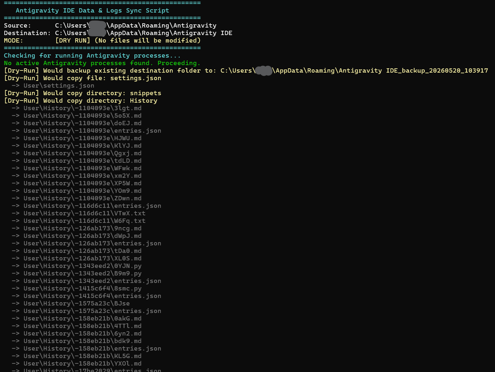

# Antigravity Data Sync

Syncs configuration and logs from Antigravity to Antigravity IDE.

## Usage

Start with a dry run to list all files that will be sync'd, then run without options to perform the actual sync:

### Windows (PowerShell)
```powershell
# 1. Dry run (shows files to be copied)
./sync_antigravity_data.ps1 -DryRun

# 2. Actual sync
./sync_antigravity_data.ps1
```

### Linux / macOS (Bash)
```bash
# 1. Dry run (shows files to be copied)
chmod +x sync_antigravity_data.sh
./sync_antigravity_data.sh --dry-run

# 2. Actual sync
./sync_antigravity_data.sh
```

## Dry Run Preview



